# InventoryTracker

InventoryTracker is a multi-client inventory management system built with ASP.NET Core, Entity Framework Core, ASP.NET Core Identity, JWT authentication, CQRS, and a Clean Architecture-inspired structure.

The project focuses on backend architecture, secure API design, reusable client/API integration, and practical inventory workflows such as stock adjustments, issues, returns, and warehouse transfers.

## Highlights

- ASP.NET Core Web API with secured admin and user endpoints
- ASP.NET Core Identity authentication with JWT access tokens and refresh tokens
- Role-based authorization for Admin and User flows
- Clean Architecture-inspired solution structure with Domain, Application, Infrastructure, API, Contracts, and client projects
- CQRS with MediatR commands, queries, handlers, and validation pipeline
- FluentValidation with global API exception handling
- Entity Framework Core with SQL Server, migrations, auditing, and soft delete support
- Transaction-based stock control instead of direct stock editing
- Reusable API client layer for MVC clients
- WebAdmin MVC client with CRUD, pagination, filtering, search, and transaction approval/cancellation
- WebOperator MVC client
- React Native / Expo mobile client for operator transaction workflows

## Current Status

The backend API, WebAdmin MVP, WebOperator MVP and Mobile MVP are functional.

Implemented:

- Authentication, refresh token flow, and logout
- User management with role assignment and active/inactive users
- Master data management for items, clients, countries, and warehouses
- Inventory transaction creation, editing, approval, and cancellation
- Stock updates when transactions are approved
- Paginated browsing, filtering, and search
- Shared request/response contracts between API and clients
- Automatic token refresh handling in web and mobile clients

In progress:

- Additional mobile features
- Client balance support
- Transaction document generation
- Deployment setup
- Automated test coverage

## Architecture

```text
InventoryTracker.API             - ASP.NET Core Web API
InventoryTracker.Application     - CQRS commands, queries, handlers, validation
InventoryTracker.Domain          - Domain entities and business model
InventoryTracker.Infrastructure  - EF Core, Identity, persistence, services
InventoryTracker.Contracts       - Shared request/response DTOs
InventoryTracker.Shared          - Shared enums and common types
InventoryTracker.APIClient       - Reusable HTTP/API client layer
InventoryTracker.AuthClient      - Authentication client layer
InventoryTracker.WebAdmin        - ASP.NET MVC admin client
InventoryTracker.WebOperator     - ASP.NET MVC operator client
InventoryTracker.Mobile          - React Native / Expo mobile client
```

## Core Features

### Authentication and Authorization

- ASP.NET Core Identity
- JWT bearer authentication
- Refresh token rotation
- Login, refresh, and logout flow
- Role-based access control
- Admin and User roles
- Inactive users blocked from login

### Admin Management

- User listing, search, and pagination
- User creation and editing
- Role assignment
- User activation/deactivation
- CRUD for items, clients, countries, and warehouses

### Inventory Transactions

Stock is controlled through transaction workflows rather than direct manual stock edits.

Supported transaction types:

- Adjustment
- Issue to client
- Return from client
- Transfer between warehouses

Supported transaction behavior:

- Draft transaction creation and editing
- Approval workflow
- Cancellation workflow
- Stock changes on approval
- Warehouse-based stock tracking
- Item snapshot data stored on transaction items

## API

Example endpoint groups:

- `/api/auth`
- `/api/admin/users`
- `/api/admin/items`
- `/api/admin/clients`
- `/api/admin/warehouses`
- `/api/admin/stocks`
- `/api/admin/transactions`
- `/api/user/transactions`
- `/api/lookups`

Swagger/OpenAPI is available in development.

## Client Integration

Web clients communicate with the API through reusable client services.

The client layer includes:

- Typed API service classes
- Shared contracts
- `AccessTokenHandler` for attaching bearer tokens
- Automatic refresh token handling
- Centralized API error parsing
- `ServiceResult` pattern for success, validation, and error responses

## Tech Stack

### Backend

- C#
- ASP.NET Core
- ASP.NET Core Identity
- Entity Framework Core
- SQL Server
- MediatR
- FluentValidation
- JWT Bearer Authentication
- Swagger / OpenAPI

### Clients

- ASP.NET MVC
- Razor Views
- React Native
- Expo
- TypeScript

## Running the Project

### Requirements

- Visual Studio 2022 or compatible IDE
- .NET 10 SDK
- SQL Server or SQL Server LocalDB
- Node.js and npm for the mobile client

### API Setup

1. Configure the API connection string.
2. Configure JWT settings through local development configuration in `appsettings.json` or user secrets.
3. Configure an optional seeded admin user.
4. Apply EF Core migrations.
5. Run `InventoryTracker.API`.

Example:

```bash
dotnet ef database update --project InventoryTracker.Infrastructure --startup-project InventoryTracker.API
dotnet run --project InventoryTracker.API
```

### WebAdmin Setup

1. Make sure the API is running.
2. Configure `ApiSettings:BaseUrl` in the WebAdmin settings.
3. Run `InventoryTracker.WebAdmin`.

```bash
dotnet run --project InventoryTracker.WebAdmin
```

### Mobile Setup

```bash
cd InventoryTracker.Mobile/inventory-tracker
npm install
npx expo start -c
```

## Screenshots

### WebAdmin

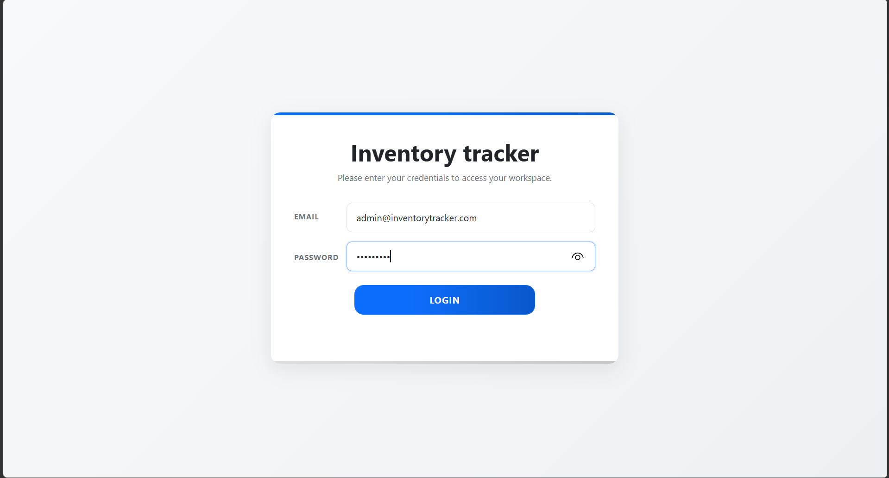

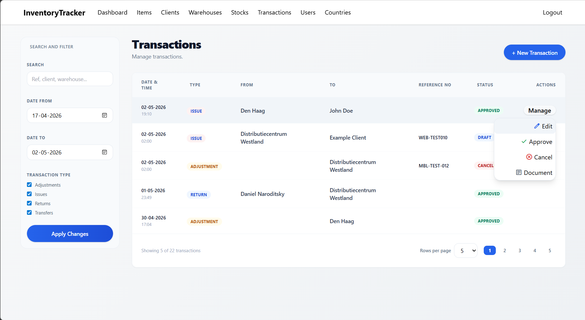

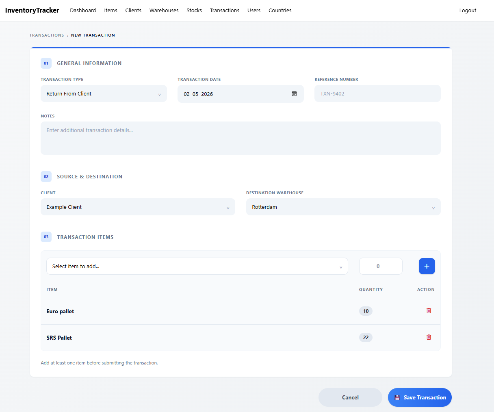

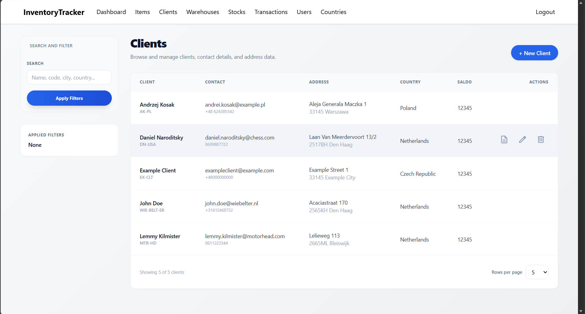

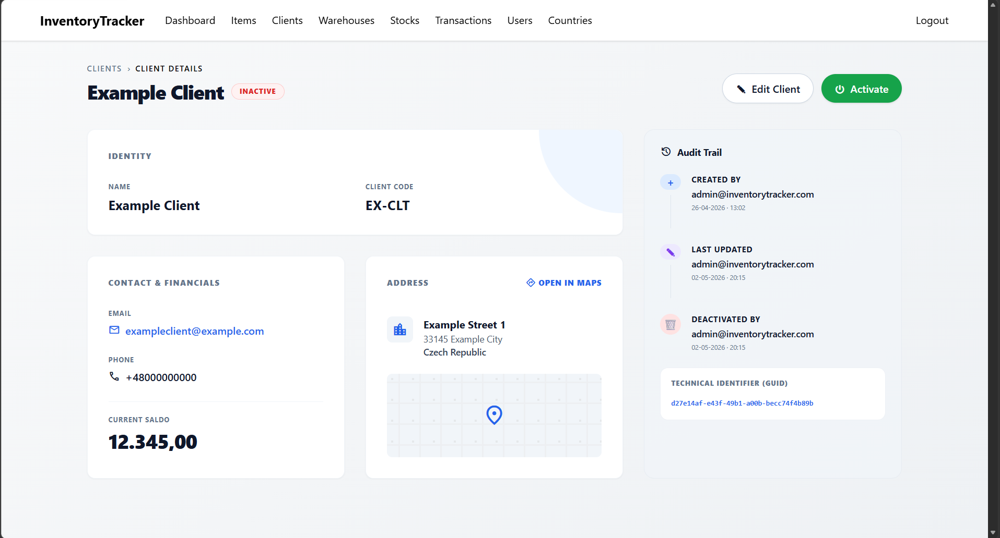

### Mobile

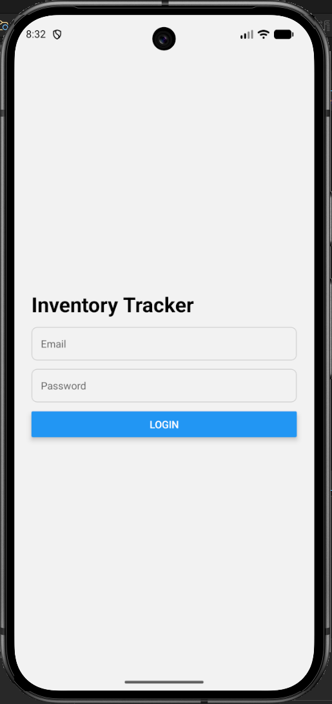

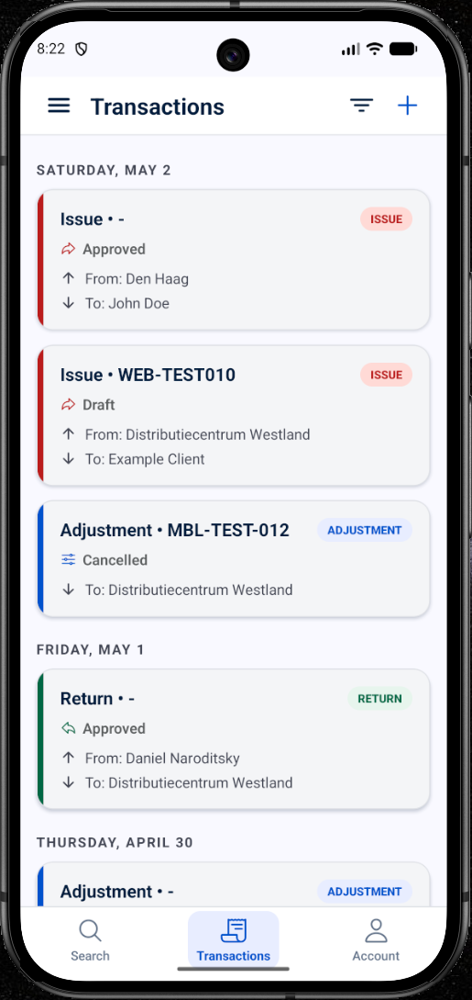

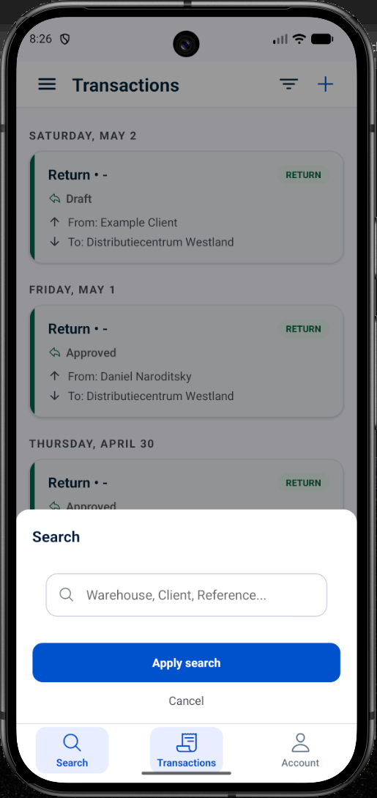

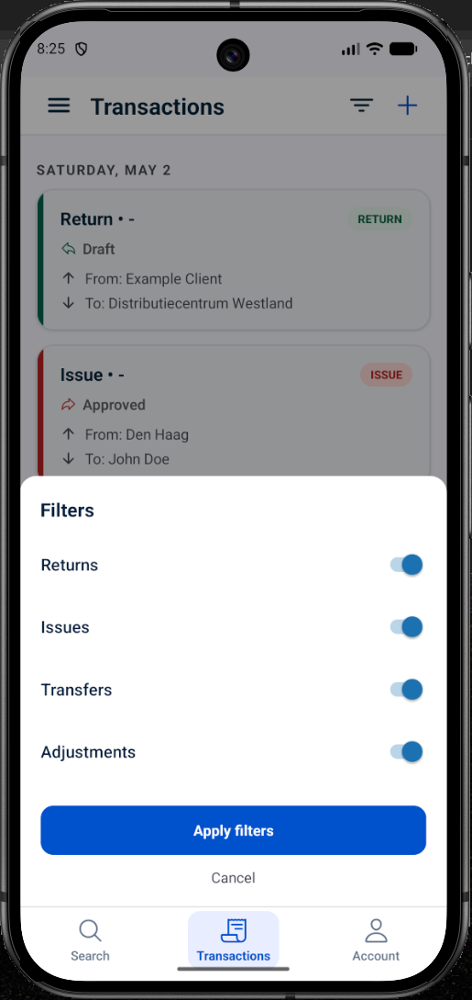

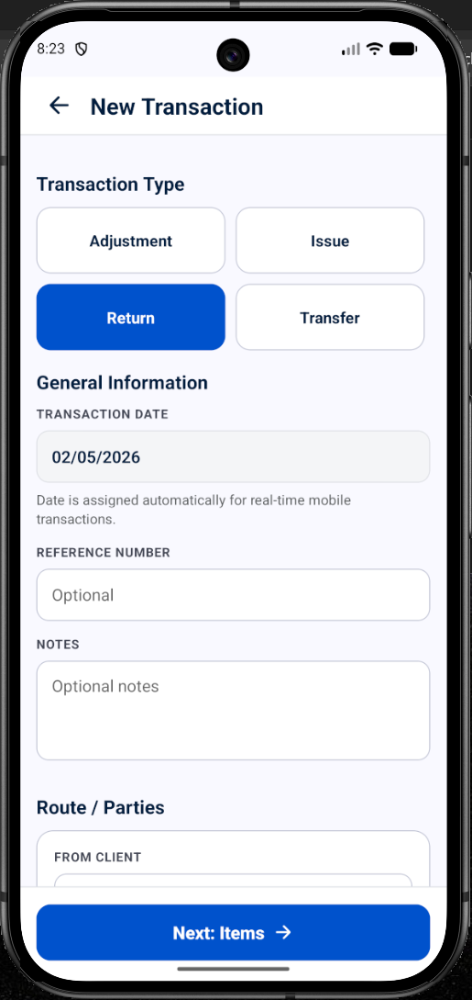

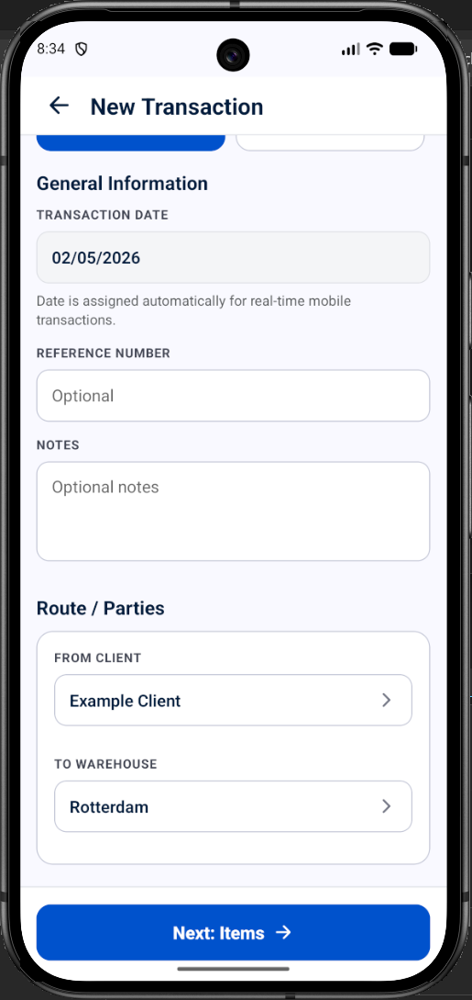

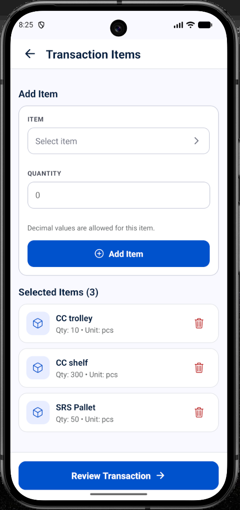

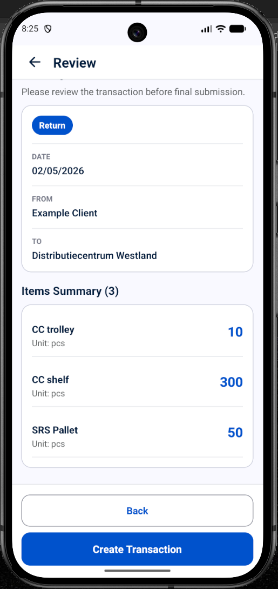

### WebOperator

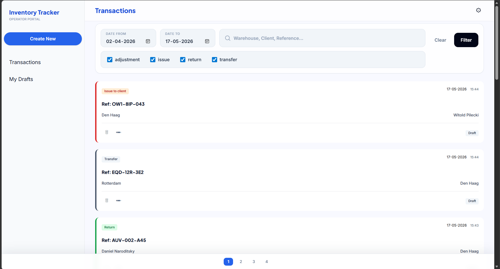

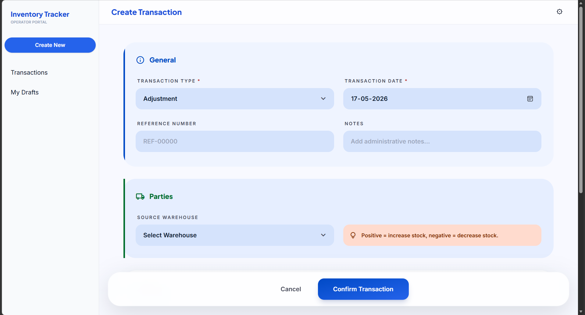

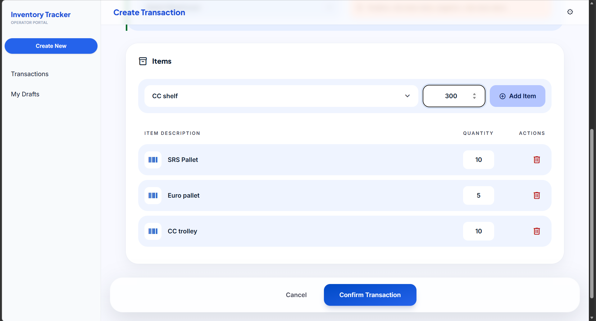

## Roadmap

- Add automated unit and integration tests
- Add GitHub Actions build/test workflow
- Complete web and mobile clients
- Expand db model and domain dictionaries
- Add Client balance support
- Add transaction document generation
- Add storage support for uploading photos while creating transactions
- Improve deployment configuration
- Move production-like secrets fully out of committed configuration

## Notes

This is an active learning and portfolio project. The current focus is backend architecture, API design, client/API integration, and realistic inventory workflows.
